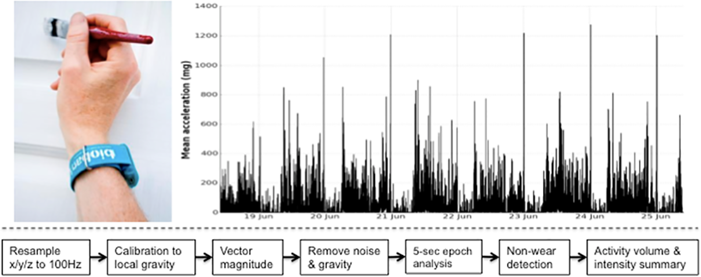

[](https://github.com/activityMonitoring/biobankAccelerometerAnalysis/releases/)


A tool to extract meaningful health information from large accelerometer datasets. The software generates time-series and summary metrics useful for answering key questions such as how much time is spent in sleep, sedentary behaviour, or doing physical activity.

## Installation

```bash
pip install accelerometer
```

You also need Java 8 (1.8.0) or greater. Check with the following:

```bash
java -version
```

You can try the following to check that everything works properly:
```bash
# Create an isolated environment
$ mkdir test_baa/ ; cd test_baa/
$ python -m venv baa
$ source baa/bin/activate

# Install and test
$ pip install accelerometer
$ wget -P data/ http://gas.ndph.ox.ac.uk/aidend/accModels/sample.cwa.gz  # download a sample file
$ accProcess data/sample.cwa.gz
$ accPlot data/sample-timeSeries.csv.gz
```

## Usage
To extract summary movement statistics from an Axivity file (.cwa):

```bash
$ accProcess data/sample.cwa.gz

 <output written to data/sample-outputSummary.json>
 <time series output written to data/sample-timeSeries.csv.gz>
```

Movement statistics will be stored in a JSON file:
```json
{
    "file-name": "sample.cwa.gz",
    "file-startTime": "2014-05-07 13:29:50",
    "file-endTime": "2014-05-13 09:49:50",
    "acc-overall-avg(mg)": 32.78149,
    "wearTime-overall(days)": 5.8,
    "nonWearTime-overall(days)": 0.04,
    "quality-goodWearTime": 1
}
```

See [Data Dictionary](https://biobankaccanalysis.readthedocs.io/en/latest/datadict.html) for the list of output variables.

Actigraph and GENEActiv files are also supported, as well as custom CSV files. See [Usage](https://biobankaccanalysis.readthedocs.io/en/latest/usage.html#basic-usage) for more details.

To visualise the activity profile:
```bash
$ accPlot data/sample-timeSeries.csv.gz
 <output plot written to data/sample-timeSeries-plot.png>
```


## Under the hood
Interpreted levels of physical activity can vary, as many approaches can be
taken to extract summary physical activity information from raw accelerometer
data. To minimise error and bias, our tool uses published methods to calibrate,
resample, and summarise the accelerometer data.




See [Methods](https://biobankaccanalysis.readthedocs.io/en/latest/methods.html) for more details.


## Citing our work
When using this tool, please consider the works listed in [CITATION.md](CITATION.md).

## Licence
See [LICENSE.md](LICENSE.md).


## Acknowledgement
We would like to thank Sven Hollowell, Vincent van Hees, Nick Wareham, 
Soren Brage, Nils Hammerla and Dan Jackson, 
all of whom thoroughly supported the early development of this software. 
We would also like to thank all our code contributors. 

[Contributors Graph](https://github.com/OxWearables/biobankAccelerometerAnalysis/graphs/contributors)
